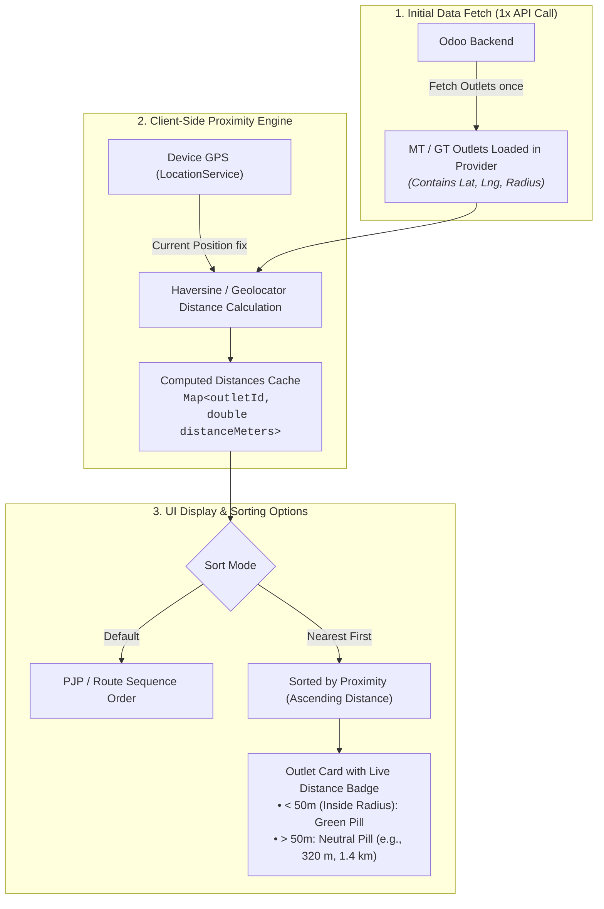

# Client-Side Outlet Proximity Calculation & Sorting Plan

**Target Application:** Flutter Mobile App (`secondary_sales`)  
**Backend:** Odoo 18 REST API (`gdfl` suite)  
**Scope:** Modern Trade (`MtOutletsScreen`) & General Trade (`RouteDetailScreen`, `OutletsListScreen`)

---

## 1. Executive Summary & Core Principle

### 1.1 The Challenge
Field sales officers and merchandisers move constantly between stores and retail shops. Sorting outlets by physical proximity (closest store first) significantly speeds up check-in and route navigation. However:
- **Server Risk:** Polling the Odoo backend continuously with GPS coordinates to calculate distances for dozens of outlets would cause massive database overhead and server slowdowns.
- **Device Risk:** Aggressive GPS polling drains battery rapidly in hot field environments.

### 1.2 The Architecture Solution: 100% Client-Side Proximity Engine
* **Zero Backend Overhead:** All distance calculations and list re-orderings are performed **locally on the device** using the high-performance `Geolocator.distanceBetween(lat1, lon1, lat2, lon2)` algorithm.
* **Pre-fetched Coordinates:** Outlets fetched from Odoo already include `latitude` (`partner_latitude`) and `longitude` (`partner_longitude`). No extra API calls are made during movement.
* **Controlled GPS Sampling & User Actions:** Proximity recalculation is triggered on screen load, on user tap of the **"Sort by Nearest"** button, on manual **GPS Refresh**, or via throttled location stream when sorting mode is active.

---

## 2. Proximity & Sorting Architecture



---

## 3. UI/UX Design & Controls

### 3.1 Top Toolbar Controls in Outlet List Screens
Add a clean control bar directly below the search bar:

```
┌─────────────────────────────────────────────────────────────┐
│ 🔍 Search store name or code...                             │
├─────────────────────────────────────────────────────────────┤
│ [ 🧭 Sort: Nearest First (Active) ]   [ 🔄 Refresh GPS ]    │
└─────────────────────────────────────────────────────────────┘
```

1. **Sort Mode Toggle Button**:
   * **State A: Default Order** (PJP Recommended schedule in MT / Route Sequence in GT).
   * **State B: Nearest First** (Sorts stores by ascending distance from device).
2. **GPS Refresh Button / Indicator**:
   * Displays GPS status (e.g. `GPS Accurate ±5m` or `Fetching fix...`).
   * Tapping triggers an instant high-accuracy location sample and animates list re-ordering.

### 3.2 Proximity Badges on Outlet Cards
Each outlet card displays an intuitive distance pill:
* **Inside Geofence Radius ($\le \text{radius}$):**  
  `📍 Inside Store (28 m)` — Highlighted with green border/badge, indicating instant check-in is ready.
* **Nearby ($< 1 \text{ km}$):**  
  `📍 340 m away`
* **Farther ($\ge 1 \text{ km}$):**  
  `📍 2.8 km away`
* **Missing Coordinates / No GPS Fix:**  
  `📍 Location unavailable` (placed at the bottom when sorted by distance).

---

## 4. Technical Implementation Specification

### 4.1 Proximity Model Extension
Add a computed/cached distance helper to outlet data structures:

```dart
class OutletDistanceHelper {
  static double? calculateDistance({
    required double? userLat,
    required double? userLng,
    required double? outletLat,
    required double? outletLng,
  }) {
    if (userLat == null || userLng == null || outletLat == null || outletLng == null) {
      return null;
    }
    if (outletLat == 0.0 && outletLng == 0.0) return null;
    
    return Geolocator.distanceBetween(userLat, userLng, outletLat, outletLng);
  }

  static String formatDistance(double? distanceMeters) {
    if (distanceMeters == null) return 'No GPS';
    if (distanceMeters < 1000) {
      return '${distanceMeters.round()} m';
    }
    return '${(distanceMeters / 1000).toStringAsFixed(1)} km';
  }
}
```

### 4.2 State Management in Providers
In [`ModernTradeProvider`](file:///home/abrar/AndroidStudioProjects/secondary_sales/lib/features/modern_trade/modern_trade_provider.dart) and [`RouteProvider`](file:///home/abrar/AndroidStudioProjects/secondary_sales/lib/features/routes/route_provider.dart):
* **State Variables:**
  * `Position? _currentPosition`
  * `bool _sortByNearest = false`
  * `bool _isCalculatingDistance = false`
  * `Map<int, double> _outletDistances = {}`
* **Methods:**
  * `Future<void> updateCurrentPosition({bool forceRefresh = false})`
  * `void toggleSortByNearest()`
  * `List<T> getSortedOutlets()`

### 4.3 Battery-Friendly Location Updates
* When the screen is opened, acquire a high-accuracy GPS fix once.
* When "Sort by Nearest" is toggled ON, listen to location changes with a **distance filter of 20 meters** (`distanceFilter: 20`):
  * Only recalculates distances when the field rep has moved at least 20 meters.
  * Disposes of the GPS subscription as soon as the screen is closed or navigated away from.

---

## 5. Edge Cases & Safety Handling

| Scenario | Behavior / Mitigation |
| :--- | :--- |
| **GPS Permission Denied** | Shows a warning banner with "Enable Location" button; falls back to default schedule order. |
| **Outlets with Null / (0,0) Coordinates** | Ranked at the bottom of the list with a "Coordinates not set" tag. |
| **Indoor / Weak GPS Drift** | Uses `LocationAccuracy.high` with a 10s timeout, falling back gracefully to last known position. |
| **Active Checked-In Store** | Always pinned to the top of the list regardless of distance sort mode. |

---

## 6. Action Plan & Next Steps

1. **Step 1:** Create `lib/core/util/proximity_helper.dart` for reusable distance calculation & formatting.
2. **Step 2:** Update [`ModernTradeProvider`](file:///home/abrar/AndroidStudioProjects/secondary_sales/lib/features/modern_trade/modern_trade_provider.dart) with location state & nearest-first sorting logic.
3. **Step 3:** Enhance [`MtOutletsScreen`](file:///home/abrar/AndroidStudioProjects/secondary_sales/lib/features/modern_trade/screens/mt_outlets_screen.dart) with Sort toggle, Refresh button, and distance chips.
4. **Step 4:** Mirror the same proximity sorting capabilities in General Trade route screens.
