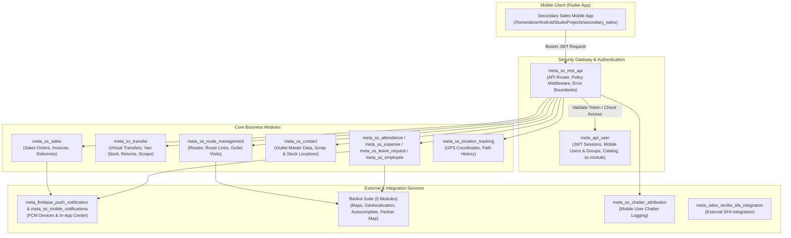

# Secondary Sales (SS) & Sales Force Automation (SFA) — System Architecture & Knowledge Base

This file serves as the single source of truth for AI agents (including Gemini / Antigravity) and developers working on the **Secondary Sales Mobile & Backend Ecosystem**.

Backend location: `/home/abrar/odoo/odoo_18/custom/gdfl`
Flutter App location: `/home/abrar/AndroidStudioProjects/secondary_sales`

---

## 1. High-Level Architecture & Component Map



---

## 2. Comprehensive Inventory of the 19 Secondary Sales Modules

Below is the complete catalog of all 19 custom Odoo backend modules in `/home/abrar/odoo/odoo_18/custom/gdfl` powering Secondary Sales.

| # | Module Folder | Module Name | Primary Purpose | Key Models & Controllers |
|---|---|---|---|---|
| **1** | [`meta_api_user`](file:///home/abrar/odoo/odoo_18/custom/gdfl/meta_api_user) | Meta API User | Mobile user management, JWT auth, refresh sessions, mobile groups (`res.mobile.user.group`), UI resource catalog (`mobile.ui.resource`), and module-level access (`ss.module`). | Models: `res.mobile.user`, `mobile.auth.session`, `mobile.role`, `mobile.ui.resource`, `ss.module`<br>Controller: `mobile_auth_controller.py` |
| **2** | [`meta_ss_rest_api`](file:///home/abrar/odoo/odoo_18/custom/gdfl/meta_ss_rest_api) | Meta SS REST API | Central gateway, HTTP error boundaries (`@mobile_api_error_boundary`), RBAC policy engine (`MobilePolicy`, `require_ui_access`), shared products, warehouses, and dashboard endpoints. | Utils: `common.py`, `mobile_policy.py`, `access_keys.py`, `helpers.py`<br>Controllers: `access_control.py`, `dashboard.py`, `products.py`, `warehouses.py`, `locations.py`, `van_loading.py` |
| **3** | [`meta_ss_route_management`](file:///home/abrar/odoo/odoo_18/custom/gdfl/meta_ss_route_management) | Meta SS Route Management | Beat route management, route planner lines, outlet visits (`outlet.visit`), visit check-ins, joint visits, and daily route performance analytics. | Models: `route.management`, `route.line`, `route.planner`, `outlet.visit`<br>Controllers: `routes.py`, `visits.py` |
| **4** | [`meta_ss_location_tracking`](file:///home/abrar/odoo/odoo_18/custom/gdfl/meta_ss_location_tracking) | Secondary Sales - Location Tracking | Sales Officer GPS coordinate tracking (`sales.employee.location`), batch location sync (`/api/v1/employee/location/sync`), path checkpoint history, and team tracking dashboard. | Model: `sales.employee.location`<br>Controller: `location_api.py` |
| **5** | [`meta_ss_attendance`](file:///home/abrar/odoo/odoo_18/custom/gdfl/meta_ss_attendance) | Meta Secondary Sales - Attendance | Geofenced attendance check-in/out endpoints (`hr.attendance`), Haversine distance validation against distributor/outlet coordinates, and attendance bypass flags. | Models: `hr.attendance`, `res.mobile.user.group` extensions<br>Controller: `attendance.py` |
| **6** | [`meta_ss_sales`](file:///home/abrar/odoo/odoo_18/custom/gdfl/meta_ss_sales) | Meta SS Sales | Mobile secondary sale orders (`sale.order`), delivery pickings, demand vs damaged stock validation, auto-invoicing, and sales target tracking (`sale.target`). | Models: `sale.order`, `stock.picking`, `sale.target`<br>Controllers: `sales.py`, `deliveries.py`, `sale_order_details.py` |
| **7** | [`meta_ss_transfer`](file:///home/abrar/odoo/odoo_18/custom/gdfl/meta_ss_transfer) | Meta SS Transfer | Van loading/unloading virtual stock transfers (`stock.location`), customer return deliveries, scrap picking flows, and virtual location APIs. | Models: `stock.location`, `stock.move`, `stock.picking`<br>Controllers: `virtual_transfers.py`, `virtual_locations.py`, `returns.py`, `scraps.py` |
| **8** | [`meta_ss_expense`](file:///home/abrar/odoo/odoo_18/custom/gdfl/meta_ss_expense) | Secondary Sales - Expense API | Mobile expense submission API (`hr.expense.sheet`), category listing, expense receipt upload, and manager approval/rejection workflows. | Model: `hr.expense.sheet` extensions<br>Controller: `expense.py` |
| **9** | [`meta_ss_leave_request`](file:///home/abrar/odoo/odoo_18/custom/gdfl/meta_ss_leave_request) | Secondary Sales - Leave Request API | Mobile leave management (`hr.leave`), balance inquiries, leave submission APIs with attachment support, and manager action endpoints. | Model: `hr.leave` extensions<br>Controller: `leave_api.py` |
| **10** | [`meta_ss_contact`](file:///home/abrar/odoo/odoo_18/custom/gdfl/meta_ss_contact) | Meta SS Contact | Extends `res.partner` for outlet master data, setting up stock and scrap virtual locations per outlet, distributor parent-child links, and outlet onboarding APIs. | Model: `res.partner` extensions<br>Controller: `contacts.py` |
| **11** | [`meta_ss_employee`](file:///home/abrar/odoo/odoo_18/custom/gdfl/meta_ss_employee) | Meta SS Employee | Employee directory APIs, team hierarchy sync, profile updates, and subordinate directory access endpoints. | Model: `hr.employee` extensions<br>Controller: `employees.py` |
| **12** | [`meta_ss_chatter_attribution`](file:///home/abrar/odoo/odoo_18/custom/gdfl/meta_ss_chatter_attribution) | Meta SS Chatter Attribution | Overrides `mail.message` chatter feed logging to attribute edits executed by system integration user accounts back to the actual acting mobile user/employee. | Model: `mail.message` inheritance |
| **13** | [`meta_ss_mobile_notifications`](file:///home/abrar/odoo/odoo_18/custom/gdfl/meta_ss_mobile_notifications) | Meta SS Mobile Notifications | Mobile app notification center (`mobile.push.notification`), read state tracking, list & count APIs for the Flutter app. | Model: `mobile.push.notification` extensions<br>Controller: `notification.py` |
| **14** | [`meta_firebase_push_notification`](file:///home/abrar/odoo/odoo_18/custom/gdfl/meta_firebase_push_notification) | Meta Firebase Push Notification | Core FCM infrastructure—registers device tokens (`mobile.device`), handles background message dispatching, and hooks into Sales, Expense, Leave, and Stock picking events. | Models: `mobile.device`, `mobile.notification.service`, `mobile.notification.mixin`<br>Controller: `device.py` |
| **15** | [`meta_barikoi_base`](file:///home/abrar/odoo/odoo_18/custom/gdfl/meta_barikoi_base) | Meta Barikoi Maps Base | Base module for Barikoi Maps integration in Bangladesh. Wraps Barikoi REST API endpoints (`barikoi.api`) and system config settings. | Models: `barikoi.api`, `res.config.settings`<br>Controller: `main.py` |
| **16** | [`meta_barikoi`](file:///home/abrar/odoo/odoo_18/custom/gdfl/meta_barikoi) | Barikoi Maps for Odoo | Umbrella wrapper module combining all Barikoi map features for Odoo web interface. | Depends on: `meta_barikoi_base`, `meta_barikoi_address_autocomplete`, `meta_barikoi_geolocalize` |
| **17** | [`meta_barikoi_address_autocomplete`](file:///home/abrar/odoo/odoo_18/custom/gdfl/meta_barikoi_address_autocomplete) | Meta Barikoi Address Autocomplete | Address autocomplete functionality using Barikoi API for Bangladesh addresses. | Models: `res.partner`, `res.company`<br>Controller: `main.py` |
| **18** | [`meta_barikoi_geolocalize`](file:///home/abrar/odoo/odoo_18/custom/gdfl/meta_barikoi_geolocalize) | Meta Barikoi Geolocalize | Partner reverse-geocoding and lat/long coordinate integrity overrides (prevents coordinate resetting to 0.0). | Models: `res.partner` overrides |
| **19** | [`meta_barikoi_partner_map`](file:///home/abrar/odoo/odoo_18/custom/gdfl/meta_barikoi_partner_map) | Meta Barikoi Partner Map | Embedded MapLibre/Leaflet interactive partner map display in Odoo views. | Model: `res.partner` view extensions |

*(Note: `meta_odoo_recibo_sfa_integration` is also present for external Recibo SFA inventory & order sync).*

---

## 3. Core Developer Patterns & Guidelines

### A. API Controller Pattern
Every mobile REST API endpoint MUST follow this pattern:
```python
from odoo import http
from odoo.addons.meta_ss_rest_api.utils.common import (
    API_PREFIX,
    API_VERSION,
    get_mobile_api_context,
    mobile_api_error_boundary,
)
from odoo.addons.meta_ss_rest_api.utils.access_keys import AccessKey
from odoo.addons.meta_ss_rest_api.utils.mobile_policy import require_ui_access

class SampleApiController(http.Controller):

    @http.route(
        f"{API_PREFIX}/sample/endpoint",
        type="json",
        auth="user",
        methods=["POST"],
    )
    @mobile_api_error_boundary
    def sample_endpoint(self, **payload):
        # 1. Extract context & validate bearer JWT token
        mobile_user, api_env, payload = get_mobile_api_context(
            payload, require_employee=True
        )

        # 2. Enforce Role-Based Access Control (RBAC) gate
        require_ui_access(mobile_user, AccessKey.SECONDARY_SALES_CREATE)

        # 3. Perform business logic using api_env
        # ...

        return {
            "success": True,
            "api_version": API_VERSION,
            "message": "Operation completed successfully.",
            "data": {},
        }
```

### B. Standard Error Boundary (`@mobile_api_error_boundary`)
- Automatically rolls back open transactions (`request.env.cr.rollback()`) on any unhandled exception to avoid partial database writes.
- Sanitizes errors into a uniform JSON response format:
  ```json
  {
    "success": false,
    "error": "validation_error",
    "message": "User-friendly error message",
    "details": {}
  }
  ```

### C. Access Control & Catalog Sync
- Access permissions are defined in `AccessKey` constants inside [`meta_ss_rest_api/utils/access_keys.py`](file:///home/abrar/odoo/odoo_18/custom/gdfl/meta_ss_rest_api/utils/access_keys.py).
- UI resources are synced from Flutter app to Odoo backend via `POST /api/v1/access/catalog/sync`.
- Roles (`res.mobile.user.group`) are assigned modules (`ss.module`) or explicit allow/deny lists for menus and buttons.

---

## 4. Key API Endpoints Sitemap

### Auth & Sessions (`meta_api_user`)
- `POST /api/v1/auth/bootstrap-session` — Initialize mobile session & user metadata.
- `POST /api/v1/auth/login` — Authenticate user and issue JWT + refresh token.
- `POST /api/v1/auth/refresh` — Refresh access token using valid refresh token.
- `POST /api/v1/auth/logout` — Revoke active mobile session.

### Dashboard & Analytics (`meta_ss_rest_api`)
- `POST /api/v1/dashboard/summary` — MTD summary metrics for employee & subordinates.

### Access Control (`meta_ss_rest_api`)
- `POST /api/v1/access/permissions` — Fetch client feature gates (`enforced` / `granted`).
- `POST /api/v1/access/catalog/sync` — Sync Flutter catalog resources into Odoo `mobile.ui.resource`.

### Routes & Visits (`meta_ss_route_management`)
- `POST /api/v1/ss/routes` — Get assigned routes.
- `POST /api/v1/ss/routes/create` — Create beat route.
- `POST /api/v1/ss/routes/<id>` — Route details.
- `POST /api/v1/visits` — List outlet visits.
- `POST /api/v1/visits/create` — Check-in / log visit.
- `POST /api/v1/visits/today` — Today's visit status.

### Sales & Deliveries (`meta_ss_sales`)
- `POST /api/v1/sales/orders` — List secondary sale orders.
- `POST /api/v1/sales/orders/create` — Create secondary sale order.
- `POST /api/v1/sales/orders/<id>` — Sale order details.
- `POST /api/v1/deliveries` — List sales delivery pickings.

### Stock Transfers, Returns & Scraps (`meta_ss_transfer`)
- `POST /api/v1/virtual-transfers` — Van loading/unloading transfers.
- `POST /api/v1/returns` — Customer return pickings list & create.
- `POST /api/v1/scraps` — Scrap pickings list & create.
- `POST /api/v1/virtual-locations` — Van stock locations directory.

### Location Tracking & Geofencing (`meta_ss_location_tracking`)
- `POST /api/v1/employee/location/sync` — Bulk batch GPS coordinates sync from mobile.
- `POST /api/v1/manager/my_team` — Manager team tracking status.
- `POST /api/v1/manager/employee/checkpoints` — Historical route checkpoints.

### HR Attendance (`meta_ss_attendance`)
- `POST /api/v1/hr/attendance/status` — Current check-in status.
- `POST /api/v1/hr/attendance/action` — Attendance check-in / check-out with geofence validation.

### Expense & Leave Requests (`meta_ss_expense`, `meta_ss_leave_request`)
- `POST /api/v1/hr/expense/list` — List expenses.
- `POST /api/v1/hr/expense/submit` — Submit new expense with receipts.
- `POST /api/v1/hr/leave/request` — Submit leave request.
- `POST /api/v1/hr/leave/action` — Approve / reject leave request.

### Firebase & Notifications (`meta_firebase_push_notification`, `meta_ss_mobile_notifications`)
- `POST /api/v1/device/register` — Register FCM device token.
- `POST /api/v1/notifications/list` — In-app notification center inbox.
- `POST /api/v1/notifications/read` — Mark notification as read.

### Barikoi Geolocation (`meta_barikoi_base`)
- `GET /barikoi/autocomplete` — Address autocompletion.
- `GET /barikoi/reverse_geocode` — Reverse geocode lat/long.

---

## 5. Reference File Links
- [Module Review Summary](file:///home/abrar/odoo/odoo_18/custom/gdfl/ss_docs/module_review.md)
- [Module Access Control Plan](file:///home/abrar/odoo/odoo_18/custom/gdfl/ss_docs/MODULE_ACCESS_PLAN.md)
- [REST API Authorization Middleware](file:///home/abrar/odoo/odoo_18/custom/gdfl/meta_ss_rest_api/utils/mobile_policy.py)
- [API Error Boundary Decorator](file:///home/abrar/odoo/odoo_18/custom/gdfl/meta_ss_rest_api/utils/common.py)
