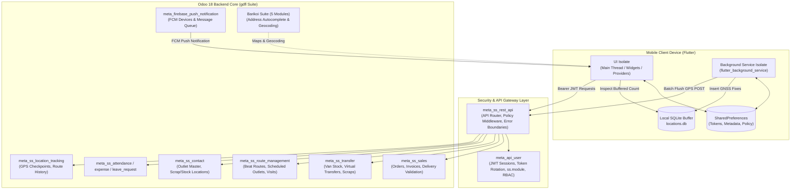
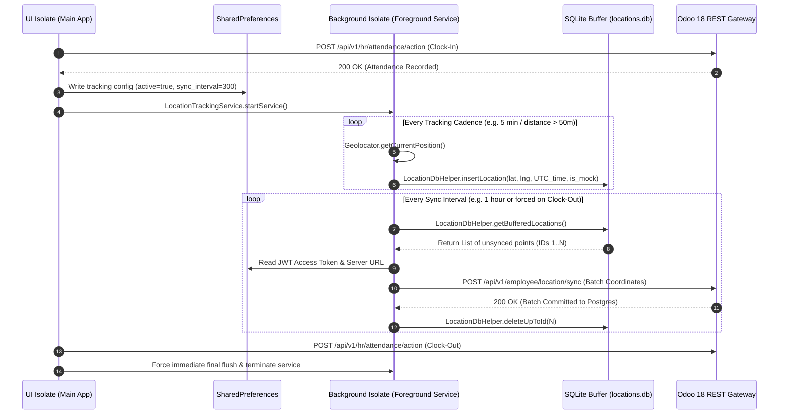
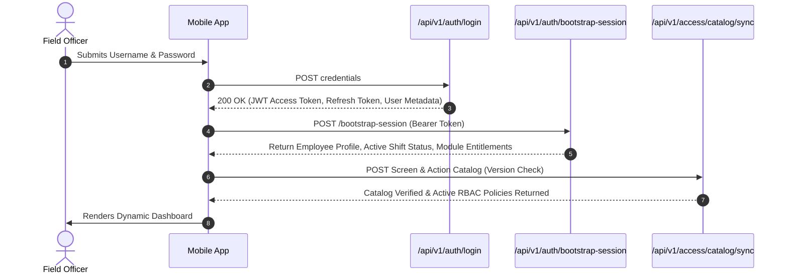
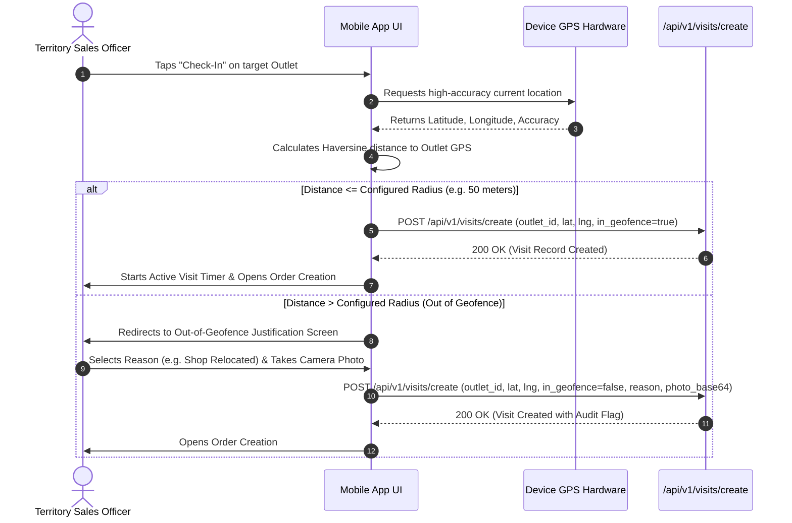
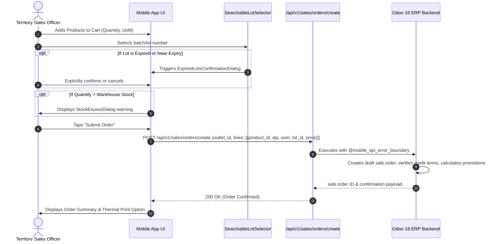

# System Architecture & Technical Data Flows
## GDFL Secondary Sales & Sales Force Automation (SFA) Mobile Application

* **Document Version:** 1.0.0
* **Target System:** `secondary_sales` (Flutter Client) & Odoo 18 ERP Backend
* **Date:** October 4, 2026
* **Location:** `/home/niaj/Documents/GDFL/secondary_sales_app/srs_documentation/02_SYSTEM_ARCHITECTURE_AND_DATA_FLOWS.md`

---

## 1. System Topology & Component Map

The application follows a distributed client-server architecture where a Flutter mobile client communicates with an Odoo 18 Enterprise ERP server via a dedicated, secure REST API gateway.

---

## 2. Multi-Isolate Execution Model (Flutter)

To guarantee that field GPS tracking continues uninterrupted even if the user minimizes the app, locks the device, or clears the app from the recent tasks list, the application utilizes a dual Dart isolate architecture:

### 2.1 The UI Isolate (Main Thread)
* **Responsibilities:** Renders the Material 3 UI widgets, handles user touches, manages feature state via Provider, executes map rendering, and performs user-initiated business transactions (Order booking, Check-in, Expense upload).
* **Network Management:** Uses a singleton `ApiService.instance` configured with interceptors for token refresh and error handling.

### 2.2 The Background Service Isolate
* **Responsibilities:** Hosted inside an Android Foreground Service (`flutter_background_service`) bound to a sticky ongoing notification (Notification ID 913: *"Attendance active"*).
* **Isolation Constraints:** The background isolate runs on a separate memory heap and cannot access the UI's Provider or `ApiService` in-memory state.
* **Coordination Protocol:**
  1. Shares persistent credentials with the UI isolate via `SharedPreferences`.
  2. Directly accesses the local SQLite database (`locations.db`) via `LocationDbHelper.instance`.
  3. Periodically flushes buffered GPS fixes to Odoo independently.
  4. Emits cross-isolate events (`service.invoke('autoCheckOutVisits', {...})`) to notify the UI isolate if a sales rep has drifted away from an outlet.

---

## 3. Detailed Technical Data Flows

### 3.1 Authentication & Session Bootstrap Flow

### 3.2 Outlet Visit & Geofence Verification Flow

### 3.3 Secondary Sales Order Booking Flow

---

## 4. Odoo 18 Backend Micro-Module Architecture

The backend architecture comprises 19 custom modules located in `/home/abrar/odoo/odoo_18/custom/gdfl`, each responsible for a distinct architectural domain:

| Domain | Modules | Core Responsibility |
|---|---|---|
| **Security & Auth** | `meta_api_user` | Mobile user sessions, JWT creation and refresh, `ss.module` management, and UI resource catalog. |
| **API Gateway** | `meta_ss_rest_api` | Central HTTP gateway, `@mobile_api_error_boundary`, RBAC policy evaluation (`require_ui_access`), and shared catalog endpoints. |
| **Sales & Distribution** | `meta_ss_sales` | Secondary sale order creation, auto-invoicing, delivery pickings, and sales target tracking. |
| **Van & Inventory Transfers** | `meta_ss_transfer` | Van mobile warehouse transfers, load-in/load-out pickings, returns, and scrap inventory movements. |
| **Route & Beat Management** | `meta_ss_route_management` | Beat route planning, scheduled outlet lines, store visit tracking, and visit performance analytics. |
| **Outlets & Master Data** | `meta_ss_contact` | Extends `res.partner` for retail outlets, auto-generates stock and scrap locations, and links distributors. |
| **Field HR & Time Tracking** | `meta_ss_attendance`, `meta_ss_expense`, `meta_ss_leave_request`, `meta_ss_employee` | Geofenced clock-in/out, paperless expense claims with receipt uploads, leave management, and employee directories. |
| **Location & Supervision** | `meta_ss_location_tracking` | High-volume GPS coordinate ingestion, batch sync endpoints, and subordinate route playback for supervisors. |
| **Push Notifications** | `meta_firebase_push_notification`, `meta_ss_mobile_notifications` | Firebase device token management, background push notifications, and in-app notification center inbox. |
| **Geospatial & Mapping** | `meta_barikoi_base`, `meta_barikoi`, `meta_barikoi_address_autocomplete`, `meta_barikoi_geolocalize`, `meta_barikoi_partner_map` | Barikoi Bangladesh maps, geocoding, reverse-geocoding, address autocomplete, and coordinate validation. |
| **Audit & Attribution** | `meta_ss_chatter_attribution` | Attributes automated system actions executed over the API back to the actual acting mobile sales representative in Odoo chatter feeds. |
