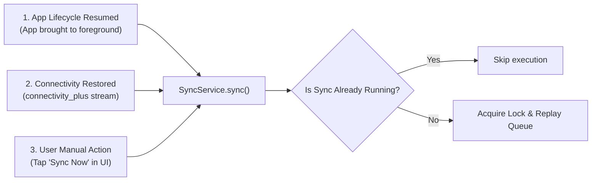

# Offline & Data Synchronization Architecture
## GDFL Secondary Sales & Sales Force Automation (SFA) Mobile Application

* **Document Version:** 1.0.0
* **Target System:** `secondary_sales` (Flutter Client) & Odoo 18 Backend
* **Date:** October 4, 2026
* **Location:** `/home/niaj/Documents/GDFL/secondary_sales_app/srs_documentation/03_OFFLINE_AND_SYNC_ARCHITECTURE.md`

---

## 1. Executive Summary & Architectural Philosophy

Field sales operations in rural and suburban Bangladesh frequently operate in areas with weak, intermittent, or absent 3G/4G cellular coverage. Ensuring that sales representatives can continue tracking routes, recording store visits, and booking retail orders without interruption is critical.

### 1.1 The "Online-First Foundation" Principle
As established in [`OFFLINE_PLAN.md`](file:///home/niaj/Documents/GDFL/secondary_sales_app/OFFLINE_PLAN.md):
1. **Odoo Remains the Single Source of Truth:** Odoo requires **zero changes** to its core business models or JSON-RPC endpoints to support offline clients. The ERP receives standard RESTful/JSON-RPC POST payloads and does not need to know whether the device was online or offline when the rep clicked submit.
2. **Flutter-Side Buffering:** The mobile client is entirely responsible for detecting connectivity changes, buffering operations into local SQLite storage, managing write queues, and replaying queued actions sequentially when connectivity returns.
3. **Decoupled Progression:** The online API surface and validation rules are stabilized first before wrapping them in transparent client-side replay interceptors.

---

## 2. Currently Active Offline Architecture

### 2.1 Background GPS Location Buffer (`LocationDbHelper`)
The GPS location tracking pipeline is currently **100% offline-capable and active in production**:

* **Database File:** `locations.db` stored in the device's sandboxed databases directory.
* **Storage Engine:** `sqflite: ^2.4.0` (ACID compliant, crash-proof).
* **Table Schema:**
  ```sql
  CREATE TABLE buffered_locations (
      id INTEGER PRIMARY KEY AUTOINCREMENT,
      latitude REAL NOT NULL,
      longitude REAL NOT NULL,
      recorded_at TEXT NOT NULL,  -- UTC format: YYYY-MM-DD HH:MM:SS
      is_mock INTEGER NOT NULL    -- 0: Hardware GNSS, 1: Mock/Spoofed
  );
  ```

### 2.2 Dedicated Isolate & Process-Surviving Mechanics
* **Independent Isolate:** The background tracking runs via `flutter_background_service` in a dedicated Dart isolate separate from the UI thread.
* **Sticky Android Foreground Service:** Bound to persistent notification ID 913 (`Attendance active`). It continues capturing GPS fixes when:
  * The user minimizes or backgrounds the application.
  * The device screen is locked.
  * The user clears the app from the Android recent tasks list.
  * The device restarts (service is resumed on boot).
* **Distance Threshold Filtering:** Coordinates are not recorded on a blind time loop. If the sales rep is stationary inside a store or at lunch, the system filters out redundant fixes, conserving both device battery and database storage.

### 2.3 Batch Flushing & Atomic Queue Eviction
* **Cadence:** Batches are flushed periodically (default every 3600 seconds, configurable down to 300 seconds) or upon shift clock-out.
* **Protocol:**
  ```dart
  // 1. Fetch buffered rows
  final rows = await LocationDbHelper.instance.getBufferedLocations();
  final maxId = rows.last['id'] as int;

  // 2. Post batch payload to Odoo
  final response = await api.post('/api/v1/employee/location/sync', {
      'checkpoints': rows.map((r) => {
          'latitude': r['latitude'],
          'longitude': r['longitude'],
          'recorded_at': r['recorded_at'],
          'is_mock': r['is_mock'] == 1,
      }).toList(),
  });

  // 3. Atomically purge accepted points upon HTTP 200 OK
  if (response.statusCode == 200) {
      await LocationDbHelper.instance.deleteUpToId(maxId);
  }
  ```
* **Collision-Free Design:** The backend orders checkpoints by `recorded_at` timestamp per attendance session. No client-side anchor row is required, preventing duplicate uploads.

### 2.4 Client-Side Proximity Matrix Caching
* **Module:** [`ProximityHelper`](file:///home/niaj/Documents/GDFL/secondary_sales_app/lib/core/util/proximity_helper.dart)
* **Mechanics:** When the outlet list is loaded, store GPS coordinates are retained in memory. The app computes real-time Haversine distance vectors locally using device GNSS hardware without requiring server roundtrips, allowing reps to identify and sort nearby stores even when offline.

---

## 3. Comprehensive Offline Write Queue Specification

The technical design detailed in [`SYNC_PLAN.md`](file:///home/niaj/Documents/GDFL/secondary_sales_app/SYNC_PLAN.md) outlines the transition of high-value transactional flows (Orders, Visits, Scraps) to full offline capability.

### 3.1 Transactions in Offline Queue Scope
| Transaction Type | Odoo Target Endpoint | Offline Action Description |
|---|---|---|
| **Store Check-In** | `POST /api/v1/visits/create` | Capture arrival timestamp, GPS coordinates, in-geofence flag, and visit photo. |
| **Secondary Sale Order** | `POST /api/v1/sales/orders/create` | Record retail order lines, selected lots, quantities, and pricing. |
| **Customer Return** | `POST /api/v1/returns` | Record returned items, package condition, and return reason codes. |
| **Scrap Picking** | `POST /api/v1/scraps` | Record spoiled dairy products sent to scrap locations. |
| **Expense Submission** | `POST /api/v1/hr/expense/submit` | Store receipt images locally and queue expense claim. |

### 3.2 Offline Sync Queue Table Schema
```sql
CREATE TABLE sync_queue (
    queue_id INTEGER PRIMARY KEY AUTOINCREMENT,
    transaction_uuid TEXT NOT NULL UNIQUE,
    endpoint TEXT NOT NULL,
    http_method TEXT NOT NULL DEFAULT 'POST',
    payload_json TEXT NOT NULL,
    created_at TEXT NOT NULL,
    status TEXT NOT NULL DEFAULT 'PENDING', -- PENDING, IN_PROGRESS, FAILED, COMPLETED
    retry_count INTEGER NOT NULL DEFAULT 0,
    last_error_message TEXT,
    entity_type TEXT NOT NULL,              -- 'sale_order', 'visit', 'return'
    local_display_label TEXT NOT NULL
);
```

### 3.3 Synchronization Trigger Points
The sync engine activates under three concurrent trigger mechanisms:


### 3.4 Replay & Conflict Resolution Protocol
1. **FIFO Sequential Replay:** Queued actions are replayed in strict chronological order based on `queue_id` to maintain causal consistency (e.g. Visit Check-In must be committed before Order Creation at that store).
2. **Optimistic Local Updates:** When the user taps "Submit" in offline mode, the transaction is saved locally and marked as `Pending Sync`. The UI immediately updates the visit or order list with a pending clock badge.
3. **Idempotency via UUIDs:** Each queued transaction includes a client-generated `transaction_uuid`. If network drops during server response transmission, subsequent retries include the same UUID, allowing Odoo to detect and prevent duplicate document creation.
4. **Conflict Handling:**
   * **Transient Errors (Timeout, Server 502/503):** Remain in `PENDING` status; retry count incremented with exponential backoff.
   * **Permanent Business Errors (Out of Credit, Expired Batch Locked):** Marked as `FAILED`; transaction is moved to a "Sync Issues" resolution drawer where the rep can modify or cancel the record with explicit feedback.

---

## 4. UI Indicators & User Experience

* **Offline Status Banner:** A top persistent bar appears whenever device connectivity is lost (`"Working Offline — Changes will sync automatically"`).
* **Pending Sync Counter:** The notification bell and drawer show a dedicated badge with the count of un-synced orders and visits.
* **Diagnostic Screen:** The existing [`LocationBufferScreen`](file:///home/niaj/Documents/GDFL/secondary_sales_app/lib/features/hr/screens/location_buffer_screen.dart) serves as the foundation for the full System Sync Center, displaying buffer sizes, memory consumption, and manual flush triggers.
