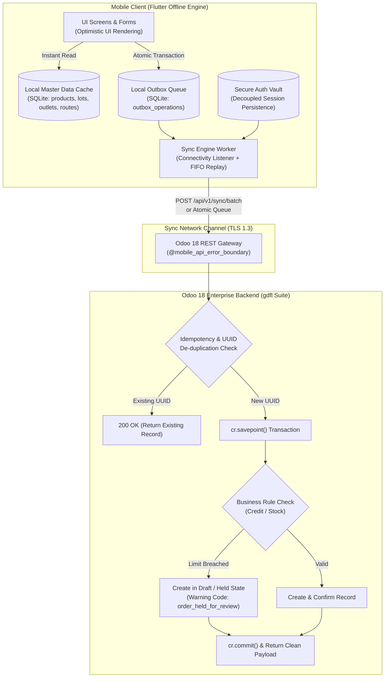

# Master Offline Architecture & Implementation Plan
## GDFL Secondary Sales & Sales Force Automation (SFA) Ecosystem

* **Document Version:** 2.0.0 (Post-Critic Foolproof Blueprint)
* **Target System:** `secondary_sales` (Flutter Client) & Odoo 18 Enterprise (`gdfl` suite)
* **Date:** October 4, 2026
* **Location:** `/home/niaj/Documents/GDFL/secondary_sales_app/srs_documentation/05_MASTER_OFFLINE_ARCHITECTURE_PLAN.md`
* **Architectural Baseline:** Inspired by Odoo POS (`point_of_sale`) & Timesheets, hardened via Tri-Perspective Critical Review (`odoo_solution_critic`).

---

## 1. Executive Summary & Strategic Objectives

The goal of this architectural blueprint is to enable seamless, reliable, and foolproof offline operation for the GDFL Secondary Sales mobile application. Field sales officers operating across rural and suburban Bangladesh will be capable of:
1. Navigating scheduled beat routes and viewing complete product, pricing, and outlet catalogs without cellular connectivity.
2. Executing store check-ins, capturing GPS coordinates, and recording visit notes offline.
3. Booking secondary sales orders with full batch/lot traceability, promotional calculation, and tax breakdown.
4. Recording customer returns, spoiled dairy scrap pickings, and shift attendance.
5. Automatically and idempotently synchronizing all field transactions with Odoo 18 Enterprise when connectivity resumes, guaranteeing **zero duplicate orders**, **zero silent data loss**, and **zero blocking of field operations**.

---

## 2. Core Architectural Pillars (The Foolproof Framework)



---

## 3. Detailed Architectural Specifications

### 3.1 Local SQLite Database Architecture (`sqflite`)
To avoid native multi-threading file locks between the continuous Background GPS Service Isolate and the UI/Sync Isolate, the local database is structured as follows:

* **Engine:** `sqflite: ^2.4.0` with explicit WAL configuration:
  ```dart
  await db.execute('PRAGMA journal_mode = WAL;');
  await db.execute('PRAGMA busy_timeout = 5000;'); // Prevents sqlite_error 5: database locked
  await db.execute('PRAGMA synchronous = NORMAL;');
  ```
* **Database Tables:**
  1. `cached_outlets` (`id`, `name`, `latitude`, `longitude`, `distributor_id`, `credit_limit`, `balance`, `write_date`)
  2. `cached_products` (`id`, `name`, `default_code`, `uom_id`, `uom_name`, `price`, `category_id`, `write_date`)
  3. `cached_lots` (`id`, `name`, `product_id`, `warehouse_id`, `expiration_date`, `qty_available`, `write_date`)
  4. `cached_routes` (`id`, `name`, `weekdays`, `sequence_json`, `write_date`)
  5. `buffered_locations` (Existing active GPS buffer)
  6. `outbox_operations` (The Transactional Outbox Queue):
     ```sql
     CREATE TABLE outbox_operations (
         id INTEGER PRIMARY KEY AUTOINCREMENT,
         operation_uuid TEXT NOT NULL UNIQUE,     -- Client-generated UUIDv4
         entity_type TEXT NOT NULL,               -- 'visit', 'order', 'return', 'scrap', 'attendance'
         endpoint TEXT NOT NULL,                  -- Target Odoo REST endpoint
         payload_json TEXT NOT NULL,              -- Full JSON request body
         parent_uuid TEXT,                        -- For causal linking (e.g. order -> visit)
         created_at TEXT NOT NULL,                -- Device UTC timestamp
         status TEXT NOT NULL DEFAULT 'PENDING',  -- PENDING, SYNCING, FAILED, COMPLETED, QUARANTINED
         retry_count INTEGER NOT NULL DEFAULT 0,
         error_code TEXT,
         error_message TEXT,
         last_attempt_at TEXT
     );
     CREATE INDEX idx_outbox_status ON outbox_operations(status);
     CREATE INDEX idx_outbox_uuid ON outbox_operations(operation_uuid);
     ```

---

### 3.2 Inbound Master Data Sync & Tombstone Tracking
* **Initial Bootstrap:** On first login or shift start, the app pulls the full dataset for the sales rep's assigned territory.
* **Delta Synchronization:** Subsequent updates fetch only records modified since the last sync:
  `POST /api/v1/sync/master-data` with payload `{"since": "2026-10-04 06:00:00"}`.
* **Soft Deletions & Tombstones:** To resolve the critic's finding regarding archived/deleted records:
  Odoo backend tracks unlinked or deactivated records via a lightweight `sync.tombstone` table storing `(res_model, res_id, unlinked_at)`. The delta sync returns:
  ```json
  {
    "products": [...],
    "outlets": [...],
    "tombstones": [
      {"model": "res.partner", "id": 402, "action": "delete"},
      {"model": "product.product", "id": 1509, "action": "archive"}
    ]
  }
  ```
  The Flutter client cleanses its local SQLite tables accordingly.

---

### 3.3 The Causal Dependency Engine: Dual-UUID Backend Resolution
* **The Elimination of Client-Side Roundtrip Patching:**
  To guarantee complete atomicity and prevent the "visit-id patching failure" identified during architectural critique:
  1. Both `outlet.visit` and `sale.order` in Odoo backend are extended with a `uuid` field (indexed with a unique SQL constraint in PostgreSQL):
     ```python
     # In meta_ss_route_management/models/outlet_visit.py
     uuid = fields.Char(string="Client UUID", readonly=True, copy=False, index=True)
     _sql_constraints = [('uuid_uniq', 'unique(uuid)', 'Visit UUID must be unique!')]

     # In meta_ss_sales/models/sale_order.py
     client_order_uuid = fields.Char(string="Client Order UUID", readonly=True, copy=False, index=True)
     visit_uuid = fields.Char(string="Visit UUID Reference", index=True)
     _sql_constraints = [('client_uuid_uniq', 'unique(client_order_uuid)', 'Order UUID must be unique!')]
     ```
  2. When the sales rep creates a visit and an order offline:
     * Check-in gets `visit_uuid = UUIDv4()`.
     * Order gets `order_uuid = UUIDv4()` and stores `visit_uuid = visit_uuid`.
  3. When replaying against Odoo:
     * Even if submitted together or out-of-order, Odoo resolves `vals['visit_id']` by searching `outlet.visit` using `visit_uuid`.
     * **Composite Batch Endpoint:** `POST /api/v1/sync/batch` allows posting `{ "visits": [...], "orders": [...], "returns": [...] }` in a single atomic database transaction (`cr.savepoint()`). If any system error occurs, the entire batch rolls back cleanly; if accepted, all records commit simultaneously.

---

### 3.4 Graceful Degradation vs. Hard Exception Policy
In field FMCG sales, physical reality in the bazaar takes precedence over server-side soft limits. When offline orders are synced:
* **Credit Limit Exceeded:** The server does **NOT** throw a `ValidationError` / HTTP 400 that blocks the sync queue. Instead, it creates the `sale.order` in `state='draft'`, tags `hold_reason='credit_exceeded'`, posts a warning to the Odoo chatter, and returns `201 Created` with a warning code `order_held_for_review`. The order is saved on the server for manager review, and the mobile queue proceeds to the next record!
* **Van Sales Physical Stock Precedence:** For van sales (DSD), the rep physically handed over the goods from the truck. If ERP stock records show a negative balance due to inventory lag, Odoo creates the order and logs an internal stock variance record rather than rejecting the customer delivery.

---

### 3.5 Non-Transient Data Errors & Interactive Remediation (The Quarantine Engine)
When an offline operation fails due to non-transient validation errors (e.g. malformed JSON, inactive/archived customer, deleted product SKU, locked fiscal period):
1. **Never Block the Outbox Queue:**
   The sync worker immediately transitions the row in `outbox_operations` from `SYNCING` to `QUARANTINED` and increments the queue pointer. It **never halts** the synchronization of subsequent visits or orders.
2. **Resolution Workflow for Inactive / Archived Customers:**
   * *Problem:* A retailer was active at 7:00 AM when the TSO cached master data, but HO archived the store at 11:00 AM. At 1:00 PM offline, the TSO booked an order.
   * *Automated Degradation on Odoo:* Odoo API checks if the parent distributor is active. If yes, it creates the order as a **"Held Order Pending Customer Reactivation"** (`hold_reason='customer_archived'`) under the parent distributor partner, generating a high-priority task for the territory sales manager.
   * *Interactive Mobile Remediation (Sync Issues Drawer):*
     If rejected by backend policy, the TSO sees an actionable resolution card with 3 options:
     * **Reassign Outlet:** Selects an alternative active outlet (e.g. branch or proprietor's second store).
     * **Request Reactivation:** Emits an automated reactivation request to HO/ASM with the TSO's GPS coordinates and notes.
     * **Cancel & Void:** Voids the local order with an audit log reason.
3. **Resolution Workflow for Malformed Payloads:**
   * *Problem:* Corrupted SQLite record or missing mandatory lot selection.
   * *Actionable "Edit & Resubmit" Wizard:* The TSO taps "Edit & Resubmit" in the Sync Issues Drawer. The app re-opens the original order creation screen with all line items, quantities, and prices pre-populated, highlighting the offending field (e.g. *"Please select an active Batch for Gazi Pure Ghee 1L"*). Once corrected, the row is re-queued as `PENDING` and synced immediately.

---

### 3.6 Multi-User Concurrency, Soft Deletions & Odoo `bus.bus` Real-Time Invalidation
When multiple sales officers share the same physical warehouse/van location, or master data (prices, customer credit ledger, stock on hand) is updated at headquarters:

```mermaid
graph TD
    subgraph "Odoo 18 Backend Event Trigger"
        EV1["Stock Level Changed / Move Done"]
        EV2["Customer Ledger / Payment Received"]
        EV3["Product Price / Scheme Updated"]
        EV4["Partner / Product Archived (Tombstone)"]
        
        BUS["Odoo bus.bus / WebSocket Layer\n(Channel: res.partner(distributor_id) / company)"]
        FCM["meta_firebase_push_notification\n(FCM Silent Data Push)"]
        
        EV1 & EV2 & EV3 & EV4 --> BUS & FCM
    end

    subgraph "Multi-Tier Client Reception"
        FCM -->|Silent Background Data Push\n(content_available: true)| BG_HANDLER["Flutter Background Receiver\n(Updates SQLite Cache)"]
        BUS -->|WebSocket Feed\n(When App is Active & Online)| WS_LISTENER["Flutter WebSocket Service\n(Live UI State Updates)"]
        POLL["Delta Sync Engine\n(POST /api/v1/sync/master-data?since=ts)"]
    end
```

1. **The 3-Tier Multi-User Sync Architecture:**
   * **Tier 1 — High-Priority Invalidation via FCM Silent Push:** When a distributor credit limit is exceeded, an outlet is blocked, or a warehouse batch is locked, Odoo broadcasts an FCM data message (`"action": "invalidate", "model": "res.partner", "id": 402, "type": "credit_hold"`). The Flutter background receiver intercepts this and marks the cached entity as dirty.
   * **Tier 2 — Real-Time WebSocket (`bus.bus`) in Active Foreground:** When online, the mobile app subscribes to Odoo's WebSocket channel for the rep's assigned distributor (`res.partner(distributor_id)`). When Rep A confirms an order that reduces on-hand warehouse stock, a `stock_update` event broadcasts to Rep B's phone within 300ms, refreshing their live lot selectors!
   * **Tier 3 — Incremental Delta Sync with Tombstones:** When returning from a 100% cellular blackout zone, the client calls `POST /api/v1/sync/master-data?since=<ts>`.
2. **Tombstone Model for Soft Deletions:**
   Standard Odoo `write_date` filters miss unlinked or archived records (`active=False`). We implement a lightweight audit model `sync.tombstone`:
   ```python
   class SyncTombstone(models.Model):
       _name = 'sync.tombstone'
       _description = 'Sync Deletion Tombstone'
       res_model = fields.Char(string='Model', required=True, index=True)
       res_id = fields.Integer(string='Record ID', required=True, index=True)
       unlinked_at = fields.Datetime(string='Unlinked At', default=fields.Datetime.now, index=True)
   ```
   Whenever a product or outlet is unlinked or archived, a database trigger or `write/unlink` override creates a tombstone. Delta sync returns tombstoned IDs, allowing the Flutter app to purge archived records locally.
3. **Multi-Rep Stock Contention at Same Location ("Two Reps, One Batch"):**
   * If Rep A and Rep B both book the last 10 cases of milk offline from the same warehouse:
   * Rep A syncs first: 10 cases reserved.
   * Rep B syncs second: Warehouse is out of stock.
   * **Rule:** Odoo backend does NOT crash or reject Rep B's order! Odoo creates the order and sets the delivery picking to `state='confirmed'` (waiting availability), while notifying the dispatcher via chatter. Physical trade reality is respected, and delivery logistics handles replenishment without dropping the customer's sale!

---

### 3.7 Granular & Master Data Re-Sync Center (The Sync Control Panel)
To give field representatives and supervisors complete control over local storage and offline data integrity, the app incorporates a dedicated **Data Synchronization & Storage Center**:

1. **Dedicated In-App UI (`SyncCenterScreen`):**
   * Accessible via `Settings -> Data Synchronization & Storage`.
   * Displays local database size (MB), pending outbox count, and domain-by-domain sync status.
   * **Granular Domain Resync Buttons:**
     * 🏪 **Outlets & Stores:** Re-syncs master outlet data, GPS coordinates, credit limits, and contact info.
     * 🥛 **Product Catalog & Pricing:** Re-syncs SKUs, packaging units, and active price lists.
     * 📦 **Inventory & Stock Lots:** Re-syncs on-hand quantities, lot batch numbers, and expiry dates for the assigned warehouse/van.
     * 🚚 **Van Operations & Transfers:** Re-syncs virtual van stock locations and transfer requests.
     * 💰 **Customer Invoices & Ledger:** Re-syncs outstanding retailer balances, aging, and recent payment status.
     * 🗺️ **Beat Routes & Schedules:** Re-syncs weekly route plans and scheduled visit lines.
   * **Master Full Re-Sync Button ("Force Full Refresh"):**
     * Prompts confirmation: *"This will refresh all master data from Odoo ERP. Unsynced orders in your outbox will NOT be affected."*
     * Drops and recreates the read cache tables, pulling a 100% fresh snapshot from Odoo while keeping `outbox_operations` and `buffered_locations` completely untouched.
2. **Backend Modular Endpoint (`POST /api/v1/sync/master-data`):**
   * Accepts request payload:
     ```json
     {
       "employee_id": 142,
       "domains": ["outlets", "products", "stock", "invoices", "routes"], // or ["all"]
       "mode": "delta", // "delta" (uses since timestamp) or "full"
       "since": "2026-10-04 06:00:00"
     }
     ```
   * Returns a structured multi-domain response, allowing the client to update specific tables independently.

---


### 3.8 Session Vault & Token Decoupling (The 401 Shield)
* **Decoupled Architecture:** The SQLite `outbox_operations` table is decoupled from user session memory.
* **Offline Token Expiry:**
  * When connectivity resumes after an extended offline period, the sync worker attempts `POST /api/v1/auth/refresh`.
  * If the refresh token is also expired, the app presents a clean **Session Re-Authentication Dialog** (asking for password / PIN / biometric).
  * **Standing Constraint:** Under NO circumstances does a 401 error clear the local SQLite database or delete un-synced outbox records.

---

### 3.9 End-of-Shift "Soft Checkout" Protocol
* Reps must never be prevented from clocking out of their shift due to pending or quarantined sync items.
* If un-synced items remain at checkout:
  * The app displays a warning dialog detailing the count of pending transactions.
  * TSO taps "Confirm Soft Checkout": captures the local checkout timestamp, records device state hash, terminates the GPS tracking service, and leaves the outbox items intact for automatic background upload as soon as Wi-Fi or cellular service stabilizes.


---

## 4. Implementation Roadmap & Phased Execution

```
┌─────────────────────────────────────────────────────────────────────────────────────────────────────────┐
│                                   OFFLINE ROLLOUT EXECUTION PHASES                                      │
├─────────┬──────────────────────────┬────────────────────────────────────────────────────────────────────┤
│ Phase   │ Scope & Components       │ Key Deliverables                                                   │
├─────────┼──────────────────────────┼────────────────────────────────────────────────────────────────────┤
│ Phase 1 │ Backend Odoo Extensions  │ • Add `uuid` & unique constraints to `outlet.visit` & `sale.order`.│
│         │ (gdfl Suite)             │ • Implement `POST /api/v1/sync/batch` composite endpoint.          │
│         │                          │ • Implement `sync.tombstone` model for soft-delete delta sync.     │
│         │                          │ • Configure graceful order degradation (`order_held_for_review`).  │
├─────────┼──────────────────────────┼────────────────────────────────────────────────────────────────────┤
│ Phase 2 │ Flutter Local Cache &    │ • Create `OfflineDatabaseHelper` with WAL mode & busy_timeout.     │
│         │ Outbox Engine            │ • Implement local tables for outlets, products, lots, routes.      │
│         │                          │ • Implement `OutboxRepository` with atomic transaction commits.    │
├─────────┼──────────────────────────┼────────────────────────────────────────────────────────────────────┤
│ Phase 3 │ UI Integration &         │ • Wire Order Creation, Check-In, Returns into local Outbox.        │
│         │ Optimistic Feedback      │ • Implement offline status banners & "Sync Issues" drawer.         │
│         │                          │ • Decouple session vault from SQLite storage.                      │
├─────────┼──────────────────────────┼────────────────────────────────────────────────────────────────────┤
│ Phase 4 │ Field Hardening &        │ • Chaos testing: Simulate 2G/EDGE dropouts, mid-request airplane   │
│         │ Concurrency Verification │   mode, process kills, and battery exhaustion.                     │
│         │                          │ • Verify zero duplicate records across multi-worker Gunicorn.      │
└─────────┴──────────────────────────┴────────────────────────────────────────────────────────────────────┘
```

This plan addresses every technical vulnerability, business exposure, and field friction point, providing an unbreakable offline-first engine for GDFL sales operations.
