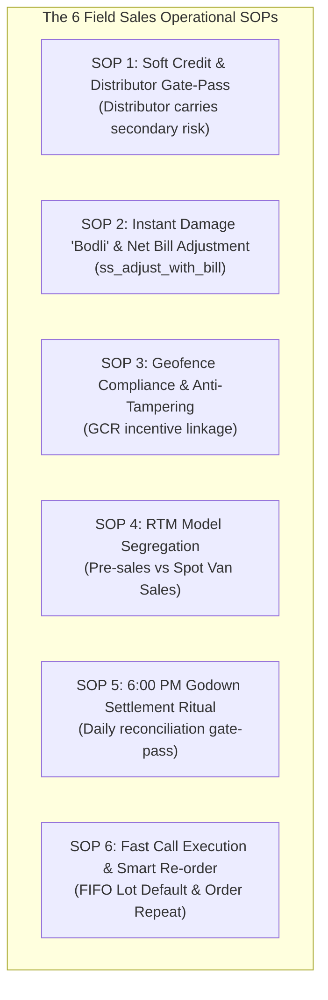

# Real-World Bangladesh FMCG Operational SOPs
## GDFL Secondary Sales & Route-to-Market Field Framework

* **Document Version:** 1.0.0
* **Author / Perspective:** General Manager – Sales & Distribution (15+ Years Bangladesh FMCG Experience)
* **Target System:** `secondary_sales` (Flutter Mobile Application) & Odoo 18 Enterprise (`gdfl` Backend)
* **Date:** October 4, 2026
* **Location:** `/home/niaj/Documents/GDFL/secondary_sales_app/srs_documentation/06_REAL_WORLD_BANGLADESH_FMCG_OPERATIONAL_SOPS.md`

---

## Executive Summary & Trade Context

In Bangladesh's fast-moving consumer goods (FMCG) and dairy distribution landscape, software fails if it ignores field human psychology, distributor working capital realities, and grocery store (*mudir dokan*) micro-economics. A Territory Sales Officer (TSO) has an average of **3 to 5 minutes** per store visit amidst heavy competition from rival SRs (Pran, Akij, Square, Meghna).

The following **6 Standard Operating Procedures (SOPs)** define the operational business rules governing the offline mobile sales application.

---



---

### SOP 1: Soft Credit Warnings & The Distributor Gate-Pass Approval Filter

#### 1. Trade Reality & Psychology
* In Bangladesh secondary trade, **the credit risk belongs to the Distributor, NOT the Manufacturing Company.**
* The manufacturer sells to the distributor on Primary terms (100% advance bank deposit, cash, or revolving bank guarantee).
* When a TSO books a secondary order for *Rahim Store*, it is the distributor’s working capital on the line. Over 75% of retail grocery operates on rolling credit (*"ager baki shodh kore notun mal neya"*).
* If a mobile app blocks an order offline because an outlet has exceeded an arbitrary company credit limit, the retailer turns to competing brands immediately, and the distributor protests because they hold personal security or trust relationships with the merchant.

#### 2. Standard Operating Procedure
1. **Field Booking Phase (Mobile App):**
   * The app **never hard-blocks** order capture in the field due to credit limits.
   * The outlet header displays a visual status:
     * 🟢 **Normal**: Under credit limit.
     * 🟡 **Credit Alert**: Outstanding balance exceeds limit (e.g. `Due: BDT 18,500 | Limit: BDT 15,000`).
   * The TSO captures the retailer's full demand without friction.
2. **ERP Ingestion & Invoicing Phase (Odoo Backend):**
   * When synced, orders breaching credit limits do not trigger hard errors. They enter an automated Odoo state: `held_for_distributor_approval`.
   * At 7:00 AM the next morning, the distributor's computer operator reviews the daily delivery run-sheet.
   * The distributor decides whether to release the order on credit, demand partial cash upon delivery, or hold dispatch.

---

### SOP 2: Instant Damage / Spoilage ("Bodli") & Net Bill Adjustment

#### 1. Trade Reality & Psychology
* Dairy products (pasteurized milk, UHT packs, yogurt/doi, flavored milk, ghee) carry inherent spoilage, souring, seal-leakage, and transit damage risks.
* When a TSO steps into a retail shop, the retailer's immediate demand is settling damaged packets from the last delivery before placing a new order: *"Ager 4 ta packet leak korse, dudh phete gese, eita age ferot nen, tarpor notun order!"*
* If damage intake and new order placement are separated into disconnected screens, the retailer refuses to place the order.

#### 2. Standard Operating Procedure
1. **Unified Net Bill Workflow (`ss_adjust_with_bill`):**
   * Inside the order screen, the TSO records:
     * Ordered Quantities (e.g. 10 Cartons UHT 250ml = BDT 4,200).
     * Damaged / Leaked Quantities (e.g. 1 Carton Leaked = BDT 420).
     * Toggles `ss_adjust_with_bill = true`.
   * **Net Bill Calculation:**
     $$\text{Net Invoice Amount} = \text{Gross Order Value} - \text{Damage Credit Adjustment}$$
2. **Audit Verification Proof:**
   * The app mandates taking a camera photo of the damaged/cut sachets showing the batch number before the adjustment is applied.
3. **Retailer Proof of Transaction:**
   * The printed thermal receipt or on-screen invoice summary displays:
     * Gross Order: BDT 4,200
     * Less Damage Adjustment: - BDT 420 (Batch #L-04)
     * **Net Payable on Delivery: BDT 3,780**

---

### SOP 3: Geofence Compliance Ratio (GCR) & Anti-Time-Tampering Audit

#### 1. Trade Reality & Psychology
* The most pervasive field sales malpractice is *"Ghore boshe order kata"* (sitting in a tea stall 500m away, phoning retailers, and faking store visits).
* If an app simply presents an unverified dropdown for out-of-geofence justification, field reps select "Shop Closed" or "Met Owner Outside" 80% of the time.

#### 2. Standard Operating Procedure
1. **Geofence Compliance Ratio (GCR) KPI:**
   * Odoo tracks every visit against the 50m–100m geofence perimeter.
   * A core monthly KPI is computed in Odoo for each TSO:
     $$\text{GCR} = \left( \frac{\text{Total Check-ins Within Geofence}}{\text{Total Scheduled Calls}} \right) \times 100$$
   * **The Policy SLA:** If a TSO's monthly GCR falls below **85%**, their monthly sales incentive, commissions, and travel allowance (TA/DA) are automatically frozen in Odoo Payroll pending physical territory audit by the Area Sales Manager (ASM).
2. **Anti-Clock-Tampering Audit:**
   * To prevent reps from rolling back phone clocks to fake morning visits, the app logs hardware uptime (`SystemClock.elapsedRealtime()`) and GNSS satellite time alongside device wall-clock time.
   * Upon synchronization, Odoo cross-references the timestamps against PostgreSQL server time, flagging any temporal drift $> 15$ minutes for supervisor review.

---

### SOP 4: Route-to-Market (RTM) Segregation: Pre-Sales vs. Ready-Stock Van Sales (DSD)

#### 1. Trade Reality & Psychology
* Pre-sales order booking and direct van sales follow fundamentally different operational physics and inventory accountability.

```
┌────────────────────────────────────────────────────────────────────────────────────────┐
│                        PRE-SALES vs. SPOT VAN SALES SOP MATRIX                         │
├───────────────────────┬────────────────────────────────┬───────────────────────────────┤
│ Dimension             │ Model A: Secondary Pre-Sales   │ Model B: Ready-Stock Van Sales│
├───────────────────────┼────────────────────────────────┼───────────────────────────────┤
│ Operating Role        │ TSO / SR (on foot / bicycle)   │ Van Salesman + Driver (Van)   │
│ Order Flow            │ Book today -> Deliver tomorrow │ Sell & Deliver off the truck  │
│ Inventory Location    │ Distributor Central Godown     │ Virtual Mobile Van Location   │
│ Physical Stock Check  │ Soft check (Warehouse total)   │ Hard check (Physical Van Box) │
│ Stock Contention      │ Handled via Backorder Picking  │ Ground reality: Van is finite │
│ Payment Flow          │ Tomorrow's delivery DSR collects│ Instant Cash on the spot     │
└───────────────────────┴────────────────────────────────┴───────────────────────────────┘
```

#### 2. Standard Operating Procedure
1. **Pre-Sales Order Flow:**
   * Offline stock checks verify against cached distributor warehouse totals. If two TSOs sell the same batch offline, Odoo confirms the orders and places any inventory deficit into a `waiting_availability` backorder picking for warehouse dispatch balancing.
2. **Spot Van Sales Flow (DSD):**
   * The delivery van is a mobile virtual warehouse (`stock.location`).
   * When selling directly from the van, **the van's physical inventory is absolute reality.**
   * The app decrements the local van stock balance in real time upon printing the memo. The salesman cannot issue 16 cartons if the van only has 15 cartons on board.

---

### 5. The 6:00 PM Distributor Godown Settlement Ritual (End-of-Day Balancing)

#### 1. Trade Reality & Psychology
* In FMCG distribution across Bangladesh, between 5:30 PM and 7:00 PM, the distributor godown undergoes the sacred daily reconciliation ritual.
* The Delivery Sales Representative (DSR) and Van Salesman return to the depot. Unsold stock is counted, physical damaged packets are dumped in the damage bin, and cash collected from retail must equal invoiced cash sales.

#### 2. Standard Operating Procedure
1. **The Godown Balancing Equation:**
   $$\text{Morning Gate Pass Stock} = \text{Delivered Sales} + \text{Unsold Van Stock} + \text{Damaged Packs Returned}$$
2. **In-App End-of-Day (EOD) Settlement Screen:**
   * At shift end, tapping "End Shift" presents the **EOD Settlement Summary**:
     * Total Productive Calls: 34 Outlets Visited / 28 Productive Calls (82% Strike Rate).
     * Total Secondary Sales Value: BDT 145,200.
     * Cash Collected: BDT 92,000 | Credit Extended: BDT 53,200.
     * Damaged Stock Adjusted: BDT 2,150 (8 SKUs).
     * Unsynced Queue Items: 0 (All Synced).
3. **Daily Sign-Off:**
   * The distributor godown manager and TSO review this summary together, sign off on-screen, and complete the day's sync before the TSO is authorized to clock out.

---

### SOP 6: High-Velocity Store Calling: 1-Tap FIFO Lot Defaults & Smart Re-Order

#### 1. Trade Reality & Psychology
* A grocery shopkeeper is constantly distracted by walk-in customers, phone calls, and other vendors. If an app requires 8 taps per product (selecting category, product, opening lot popup, choosing packaging, entering discounts), the rep abandons the app.
* To achieve the standard Bangladesh FMCG target of **35 to 45 productive calls per day** (LPC - Lines Per Call $\ge 4.5$), order booking must be lightning fast.

#### 2. Standard Operating Procedure
1. **Automated FIFO Batch Defaulting:**
   * The app **automatically selects the oldest active batch** (FIFO) from the warehouse/van without opening a dialog.
   * The rep only taps the lot selector if they are intentionally pulling a specific near-expiry promo lot.
2. **Quick Increment Chips:**
   * Product rows feature rapid numeric chips: `+1`, `+5`, `+10`, `+1 Case`, eliminating manual virtual keyboard typing with sweaty fingers.
3. **"Ager Order" (Copy Last Order) Smart Re-Order:**
   * 80% of small grocers and tea stalls re-order the exact same basket weekly (e.g. 2 cases 250ml UHT + 1 case Banana Milk).
   * A single tap on **"Copy Last Order"** populates the cart with last week's exact quantities in under 2 seconds, allowing the TSO to review, adjust, and confirm the call in under 90 seconds.

---

### Summary Checklist for Engineering & Field Implementation

| SOP # | Operational Title | Primary Technical Anchor |
|---|---|---|
| **SOP 1** | Soft Credit & Distributor Gate-Pass | Odoo state `held_for_distributor_approval`; non-blocking mobile credit badges. |
| **SOP 2** | Instant Damage Bill Adjustment | Unified `ss_adjust_with_bill` order screen with mandatory camera verification. |
| **SOP 3** | Geofence Compliance Ratio (GCR) | Odoo Payroll incentive lock if GCR $<85\%$; monotonic clock anti-tampering. |
| **SOP 4** | Pre-Sales vs Van Sales Segregation | Pre-sales backorder picking vs Van Sales hard local stock decrement. |
| **SOP 5** | 6:00 PM Godown Settlement | EOD Settlement Summary balancing gate-pass stock, cash, and returns. |
| **SOP 6** | High-Velocity Store Calling | 1-Tap FIFO lot default, quick increment chips, and "Copy Last Order" shortcut. |
